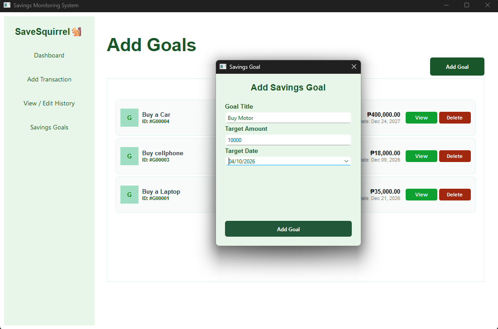

# SaveSquirrel🐿
 Savings Monitoring & Goal Tracking System

## Project Description
 SaveSquirrel is an application that works on a personal computer for the tracking of finances and aims at monitoring personal savings, income, expenses, and future goals in real time.

 Individuals often struggle to track daily personal expenses and income streams. Without a dedicated tool, cash flows become unorganized, leading to overspending and difficulties in maintaining savings and budgeting money. 
 SaveSquirrel addresses this problem by offering a unified interface to log financial transactions, categorize and calculate incomes and spendings, calculate overall net savings dynamically, maintain a searchable transaction history, and set target savings goals with specific deadline.

## Project Objectives
 - To provide a user-friendly desktop application for monitoring personal income and expenses.
 - To perform calculations for net savings from each transaction entered.
 - Enable goal management to let users set goals, view, and track their goals.
 - To provide easy transaction management, such as adding, editing, deleting, and searching of transactions.
 - To demonstrate clean software design principles using Python, PyQt6, SQLite, and Layered Architecture.

## Features
- **Dashboard Overview:** 
 Displays the summary of current total income, expenses, dynamic net savings, and display of the 20 most recent transactions.
- **Savings Transaction Logging:** 
  Easily record money in or out. Select options from dynamic dependent combobox categories (e.g., Salary or Allowance for income; Food or Transportation for expenses), set custom amounts, add descriptions(optional), and choose or set current dates.
- **Edit Transaction History & Search History:** 
  View all past transactions with search functionality to filter entries instantly by category or transaction ID. Update or delete individual transaction records directly through dedicated GUI dialogs, automatically syncing changes across the system.
- **Savings Goals Management:** 
  Set savings goals with custom target goal titles (e.g., Buying a Laptop), set target amounts, and target completion dates. View and manage active savings goals include displaying remaining days and needed amounts. Users can also remove or delete savings goals.

## Technologies Used
- Programming Language: Python
- GUI Framework: PyQt6
- Database: SQLite (sqlite3)
- Standard Python Libraries: pathlib, dataclasses, sys, datetime, sqlite3 


## Project Structure
```text
FinalSaveSquirrel/
│
├── database/
│   └── savings_database.py          # SQLite database connection & schema creator
│
├── features/
│   ├── dashboard/
│   │   ├── model2.py                # Dashboard model
│   │   ├── service2.py              # Financial totals calculation service
│   │   └── dashboard_page_view.py   # PyQt6 UI view for Dashboard summary
│   │
│   ├── savings_goal/
│   │   ├── model3.py                # Goal dataclass entity & validations
│   │   ├── repository3.py           # Goals SQL database execution repository
│   │   ├── service3.py              # Savings goal business logic & calculations
│   │   └── savings_goal_view.py     # PyQt6 UI view for Savings Goals page & dialogs
│   │
│   └── savings_management/
│       ├── model.py                 # Savings transaction dataclass entity
│       ├── repository.py            # Savings SQL database execution repository
│       ├── service.py               # Transaction business logic & input validation
│       ├── transaction_page_view.py # PyQt6 UI form view for adding transactions
│       └── history_page_view.py     # Inherited UI frame from Transaction page for searching, updating & deleting
│
└── main.py                          # Main entry point & QMainWindow sidebar navigation

```
### Purpose of Major Files

#### database/savings_database.py:
- Manages SQLite connections and executes CREATE TABLE IF NOT EXISTS scripts for savings and goals.

#### features/dashboard/:
- **model2.py**: Encapsulates private attributes for income, expense, and net savings. 
Use getters method for accessing private attributes(Read-Only).
- **service2.py**: Fetches transactions summary and computes the income totals, expense totals, and savings net balance.
- **dashboard_page_view.py**: Builds visual summary cards and renders the top 20 recent transactions.

#### features/savings_goal/:
- **model3.py**: Goal Dataclass enforcing non-empty fields and validated target amounts for savings goals.
- **repository3.py**: Handles SQL insertion, fetching, and deletion queries for goals.
- **service3.py**: Business logic and Computes remaining days (track deadlines) and the remaining amounts needed.
- **savings_goal_view.py**: Display active goal cards, goal creation pop up dialogs, goal deletion, and goal details view(UI).

#### features/savings_management/:
- **model.py**: Savings Dataclass storing individual transaction fields (trans_type, category, amount, description, date).
- **repository.py**: Executes SQL statements for adding, reading, updating, and deleting transactions.
- **service.py**: Enforces positive monetary amount validations and formats transaction history.
- **transaction_page_view.py**: Provides form UI with dependent combo boxes for adding transaction entries.
- **history_page_view.py**: Display interactive cards for past transactions with live search filtering, modifying and deletion of past transactions by clicking specific buttons.

#### Root File:
- **main.py**: Sets up QApplication, initializes database/repositories/services, constructs the sidebar navigation.

## Installation and Setup
### Prerequisites
Before running the project, make sure to install:
- **Python 3.10** or higher
- **PyQt6**
- **PyCharm** , **VS Code** or another Python IDE
- **git** #if you want to clone repository

### Instructions

1. **Clone the Repository or download the project files to your local machine**
   ```bash
   git clone https://github.com/sapphiremadzz/SaveSquirrelSystem.git #if you have git installed
   
   or click the green Code button on the GitHub and select Download ZIP directly 
   #if you don not have git installed.
   ```
   
2. **Open the Project**
   Open the `FinalSaveSquirrel` project folder in PyCharm or another Python IDE.

3. **Set Up Virtual Environment(Optional but Recommended)**
   ```bash
   python -m venv .venv
   
   #On windows 
   .venv\Scripts\activate
   #On macOS/Linux
   source .venv/bin/activate
   #if your using PyCharm, you do not need to set up VE.
   ```
   
4. **Install Dependencies like the PyQt6**
   Open the terminal inside the project and run:
   ```bash
   pip install PyQt6
   #without PyQt6 the program will failed to run so make sure to install it on your terminal
   ```

5. **Check the Project Structure**
   Make sure the folders/directories and Python files retain their package structure:
   - `database/`
   - `features/`
   - `dashboard/`
   - `savings_management/`
   - `savings_goal/`
   - `main.py`

6. **Run the Application**
   Run the main script in your terminal:
   ```bash
   python main.py
   ```
The application should create the SQLite database file when the database component is initialized.

## How to Use the System

### 1. Dashboard Overview
Upon startup, the dashboard (home page) displays your current total income, total expenses, net balance, and an activity log showing your latest 20 transactions.

### 2. Adding a Transaction
Follow these steps to log a new record:
1. Click the `+ Add Transaction` button on the sidebar.
2. Select the transaction type (`Income` or `Expense`) from the first combo box.
3. Choose a corresponding category from the dynamic dependent dropdown combo box.
4. Enter custom amount, add a description (optional), and select the transaction date, current date was also set.
5. Click `Submit Transaction` and confirm the action in the prompt. Success message prompt will display on screen if your transaction was save, otherwise failed message.

### 3. Viewing History & Editing
To audit or modify your past records:
1. Click `View / Edit History` on the sidebar.
2. Use the search bar at the top to filter transactions instantly by searching for **category name** or **transaction ID** (e.g., `#T00010`).
3. In the history table list, click `Update` to modify transaction details, or click `Delete` to completely remove the transaction.

### 4. Managing Savings Goals
To track and monitor your goals:
1. Open the `Savings Goals` tab on the sidebar.
2. Click the `Add Goal` button to open the modal dialog box.
3. Enter your **Goal Title**, **Target Amount**, and **Target Date**.
4. Click `Add Goal` to confirm and prompt success message if success otherwise failed and display success new goal card in the **Active Goals** list. 
5. Click `View` on any active card to track its deadline and see the remaining amount needed for each target amount.
6. Click `Delete` on any goal card to remove it from the system.

## OOP Implementation

SaveSquirrel strictly follows Layered Architecture and Object-Oriented Design patterns to separate database work, business calculations, and UI presentation logic.

### Key Classes

#### Database
- **`SavingsDatabase`**: Manages SQLite database instantiation and schema creation.
#### Models
- **`Savings` & `Goal`**: Domain dataclass models storing transaction and target goal attributes.
- **`Dashboard`**: Data model representing summarized income, expense, and net savings totals.
#### Repositories
- **`SavingsRepository` & `GoalRepository`**: Data Access Objects (DAOs) executing parameterized SQL commands.
#### Services
- **`SavingsService`**, **`DashboardService`**, & **`ServiceGoal`**: Service layer classes executing core business logic and operations, calculations, and validations.
#### UI Views
- **`DashboardPage`**, **`TransactionPage`**, **`HistoryPage`**, & **`SavingsGoalPage`**: Custom `QFrame` subclasses building the desktop UI views.
- **`MainWindow`**: `QMainWindow` subclass organizing the main screen layout, sidebar menu, dependencies, and page navigation.

### OOP Principles Applied

#### 1. Encapsulation
- **Data Validation**: `__post_init__` hooks inside Savings and Goal dataclasses validate field types automatically upon object instantiation.
- **Access Control**: Restricts direct access to core financial data. For example, `Dashboard` class protects internal calculations by hiding internal values using private attributes (`__income`, `__expense`, `__savings`) with double-underscores and exposes read-only getter methods:
  - `get_income()`
  - `get_expense()`
  - `get_savings()`
   ```bash
   python model2.py
  
    class Dashboard:
    def __init__(self, income: float, expense: float, savings: float):
        self.__income = float(income)
        self.__expense = float(expense)
        self.__savings = float(savings)

    def get_income(self) -> float:
        return self.__income
   ```

#### 2. Inheritance
- **PyQt6 Widget Extension**: Class inheritance is heavily utilized to extend built-in GUI frameworks. 
  - `MainWindow` inherits from `QMainWindow`.
  - `DashboardPage`, `TransactionPage`, `HistoryPage`, and `SavingsGoalPage` inherit from `QFrame`.
```bash
   class DashboardPage(QFrame): #inherit QFrame
      pass
   class MainWindow(QMainWindow): #Inherit QMainWindow
      pass
   ```
#### 3. Polymorphism
* **Method Overriding (Subclass Specialization)**: `HistoryPage` overrides inherited methods from `TransactionPage` to adapt shared components for history management:
  * `header()`: Overridden to transform the static title from *"Add Transaction"* to *"Transaction History"*.
  * `transactionBox_layout()`: Overridden to replace the data-entry form with a dynamic search bar (`QLineEdit`), a scrollable transaction list area (`QScrollArea`), and interactive record cards.
```bash
   class HistoryPage(TransactionPage): #Inherit TransactionPage

    def __init__(self, service: SavingsService):
        super().__init__(service)
        self.load_history()
        
    def header(self ):
    #Override
    def transactionBox_layout(self):
    #Override
   ```
## Database Architecture
The application relies on SQLite to manage persistent local data via `savings_management.db` file.


### Database Schema (Tables)

#### 1. Table: `savings`
Stores all individual transaction records, including income and expenses.

| Column | Type | Constraints | Description                                   |
| :--- | :--- | :--- |:----------------------------------------------|
| `id` | `INTEGER` | `PRIMARY KEY AUTOINCREMENT` | Unique transaction identifier                 |
| `type` | `TEXT` | `NOT NULL` | Transaction type (`"Income"` or `"Expense"`)  |
| `category` | `TEXT` | `NOT NULL` | Category name (e.g., Salary, Food, Allowance) |
| `amount` | `REAL` | `NOT NULL` | Transaction monetary amount                   |
| `description` | `TEXT` | *Optional* | Additional description                        |
| `date` | `TEXT` | `NOT NULL` | Transaction date in `yyyy-MM-dd` format       |

#### 2. Table: `goals`
Stores all users goals.

| Column | Type | Constraints | Description |
| :--- | :--- | :--- | :--- |
| `id` | `INTEGER` | `PRIMARY KEY AUTOINCREMENT` | Unique goal identifier |
| `title` | `TEXT` | `NOT NULL` | Title/Name of the savings goal |
| `target_amount` | `REAL` | `NOT NULL` | Target monetary savings amount |
| `target_date` | `TEXT` | `NOT NULL` | Planned target date in `yyyy-MM-dd` format |


### Database Operations (CRUD)

The system isolates database communication inside the Repository layer using **parameterized SQL queries** to ensure memory safety and prevent SQL injection vulnerabilities.

* **Create (Insert)**: Handled by `SavingsRepository.add_transaction_list()` and `GoalRepository.add_goal()`. They execute `INSERT INTO` queries to add rows into the `savings` and `goals` tables, returning the auto-generated primary key IDs.
* **Read (Select)**: Handled by `SavingsRepository.get_all_transactions()` and `GoalRepository.get_all_goals()` using `SELECT ... ORDER BY id DESC` queries to fetch records sorted from newest to oldest.
* **Update**: Executed by `SavingsRepository.update_transaction()` using parameterized `UPDATE savings SET type=?, category=?, amount=?, description=?, date=? WHERE id=?` SQL statements.
* **Delete**: Executed by `SavingsRepository.delete_transaction()` and `GoalRepository.delete_goal()` using `DELETE FROM ... WHERE id = ?` queries to remove selected rows cleanly.
* **Search / Filter**: Performed dynamically via `HistoryPage.filter_history()`. This queries memory-cached database lists to instantly match user input on search bar string and filters against matching categories or formatted text IDs.

## Screenshots

### Dashboard Page: 
This page is responsible for displaying the summary which is total savings, income, expense summary cards, and the top 20 recent transactions.

### Add Transaction page:
This page is responsible for displaying the form for adding entries and inputting transaction type and its categories (using dependent comboboxes), amount, descriptions, and date.

### View & Edit History page:
This page is responsible for displaying searchable list of logged transactions with update and delete buttons.

this is the pop up dialog for updating a transaction if users click the update button

### Savings Goal Page:
 This page is responsible for displaying active target savings cards and goal dialog popups plus view and delete buttons. Can view and track goal deadlines and needed amount.

The pop up dialog for creating or adding a new goal.

## Testing

| Test Case / Feature | Inputs                                                                                   | Expected Result                                                                                   | Actual Result                                                | Status |
| :--- |:-----------------------------------------------------------------------------------------|:--------------------------------------------------------------------------------------------------|:-------------------------------------------------------------| :--- |
| **Add Valid Transaction** | **Type:** Income<br>**Category:** Salary<br>**Amount:** `9000`<br>**Date:** `2026-09-11` | Transaction saves successfully; dashboard and history update.                                     | Transaction saved to database and UI updated.                | Pass |
| **Add Invalid Amount** | **Amount:** `-5000` or `"50abc"`                                                         | Displays warning dialog: *"Amount must be a valid number."* or *"Amount must be greater than 0."* | Warning dialog displayed; invalid input blocked.             | Pass |
| **Add Valid Savings Goal** | **Title:** `"Buy Laptop"`<br>**Target Amount:** `35000`<br>**Date:** `2026-12-31`        | Goal saves successfully and appears as a card under Active Goals Box.                             | Goal saved and active goal card rendered.                    | Pass |
| **Add Empty Goal Title** | **Title:** `" "`<br>**Target Amount:** `5000`                                            | Raises `ValueError` / Warning dialog: *"Goal Title cannot be empty"*.                             | Warning dialog displayed; submission halted.                 | Pass |
| **Search Filter** | **Search bar:** `"Salary"`                                                               | Displays only transactions matching the category *"Salary"*.                                      | List filtered dynamically to show matching entries.          | Pass |
| **Delete Transaction / Goal** | Click **Delete** on Transaction ID `#T00007` or Goal ID `#G00001` & confirm              | Item deleted from database and removed from UI box frame list.                                    | Confirmation prompted; record deleted from DB and UI frames. | Pass |
| **Update Transaction** | Change the amount from `1000` to `2000`                                                  | Database entry updates, dashboard also update.                                                    | Database entry updated and total metrics recalculated.       | Pass |

## Known Issues / Limitations
* **Fixed Window Size:** The application has a fixed minimum layout and size that can prevent the application from scaling responsively.
* **Search Limitation:** The transaction search filter works only with category name and transaction ID.
* **No Progress Indicator:** Active goal cards show text metrics (days and amounts remaining). There is no separate goal progress percentage and progress bar in the active savings goal card.
* **No Notifications:** The application does not provide any notifications regarding any approaching goal due dates or goal progress updates. So users manually view the progress to be aware.
* **Fixed Currency:** Currency values are hardcoded as Philippines Peso (`₱`) across all the user interfaces; multi-currency selection options like `$` are not yet available.
* **Static Categories:** Category values are fetched from a hardcoded dictionary in `transaction_page_view.py`. Custom user-defined categories cannot be added to the drop-down list.
* **Single-user system:** The application is designed as a single-user desktop without multiple account login.
## Author
#### Sophia Margaret B. Madronero

#### CS26(3581)